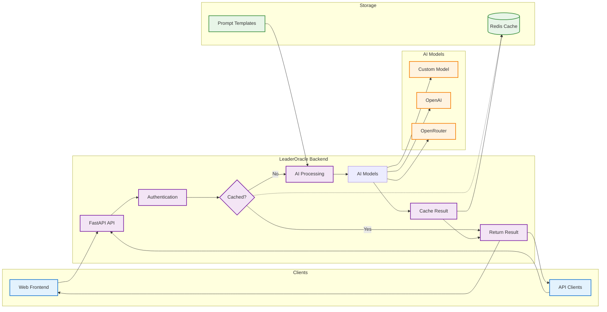

# LeaderOracle Backend

A high-performance AI-powered API for leadership and geopolitical analysis using advanced language models.

## Features

- **AI-Powered Inference**: Custom language model inference for leadership analysis
- **Batch Processing**: Efficient batch inference capabilities
- **Redis Caching**: High-performance caching for scalability
- **Authentication**: Secure API key-based authentication
- **Health Monitoring**: Built-in health checks and metrics
- **Comprehensive Testing**: Full test coverage with pytest
- **Production Ready**: Optimized for deployment with proper logging and error handling

## Table of Contents

- [Architecture](#architecture)
- [Quick Start](#quick-start)
- [API Endpoints](#api-endpoints)
- [Configuration](#configuration)
- [Testing](#testing)
- [Deployment](#deployment)
- [Development](#development)
- [Contributing](#contributing)

## Architecture

The LeaderOracle backend follows a modular architecture:

```
lo-backend/
├── api/
│   ├── core/
│   │   └── config.py          # Configuration management
│   ├── services/
│   │   ├── authentication_service.py  # Authentication logic
│   │   ├── inference_service.py       # AI model inference
│   │   ├── cache_service.py           # Redis caching
│   │   └── model_loader.py            # Model loading utilities
│   └── v1/
│       └── endpoints.py               # API endpoints
├── tests/                             # Test suite
├── main.py                           # FastAPI application
└── requirements.txt                  # Dependencies
```

### System Flow

The following diagram illustrates how the LeaderOracle backend processes requests:



### How It Works

1. **Client Request**: Web applications and API clients send leadership analysis requests
2. **Authentication**: Requests are validated using SHA-256 hashed API keys
3. **Cache Check**: System checks Redis cache for existing results
4. **AI Processing**: Cache misses trigger analysis through custom PyTorch, OpenAI, or OpenRouter models
5. **Response**: Results are cached and returned to the client for fast future access

### Key Components

1. **FastAPI Application**: High-performance async API framework
2. **Authentication Service**: SHA-256 hash-based authentication
3. **Inference Service**: PyTorch-based AI model inference with GPU optimization
4. **Cache Service**: Redis-based caching for performance
5. **Model Loader**: Optimized model loading with memory management

## Quick Start

### Prerequisites

- Python 3.8+
- Redis server (for caching)
- CUDA-capable GPU (recommended for inference)
- Required environment variables (see Configuration)

### Installation

1. Clone the repository:
```bash
git clone <repository-url>
cd lo-backend
```

2. Install dependencies:
```bash
pip install -r requirements.txt
```

3. Set up environment variables:
```bash
cp .env.example .env
# Edit .env with your configuration
```

4. Start Redis server:
```bash
redis-server
```

5. Run the application:
```bash
python main.py
```

The API will be available at `http://localhost:8000`

## 📚 API Endpoints

### Authentication

All endpoints require a valid `auth_key` parameter.

### Core Endpoints

#### Single Inference
```http
GET /api/v1/inference
```

**Parameters:**
- `input_context` (string, required): Input text for analysis
- `auth_key` (string, required): Authentication key
- `max_length` (int, optional): Maximum generation length (default: 512)
- `temperature` (float, optional): Generation temperature (default: 0.3)

**Response:**
```json
{
  "generated_text": "Generated analysis text..."
}
```

#### Batch Inference
```http
POST /api/v1/batch_inference
```

**Parameters:**
- `input_context` (string, required): Input text for analysis
- `auth_key` (string, required): Authentication key
- `num_batches` (int, optional): Number of batches (default: 1)
- `max_length` (int, optional): Maximum generation length (default: 128)
- `temperature` (float, optional): Generation temperature (default: 0.7)

**Response:**
```json
{
  "generated_texts": ["Generated text 1", "Generated text 2"]
}
```

#### Authentication Check
```http
GET /api/v1/login
```

**Body:**
```json
{
  "auth_key": "your-auth-key"
}
```

**Response:**
```json
{
  "authenticated": true
}
```

### Monitoring Endpoints

#### Health Check
```http
GET /health
```

**Response:**
```json
{
  "status": "healthy",
  "cache_status": "connected",
  "cache_enabled": true
}
```

#### Cache Statistics
```http
GET /api/v1/cache/stats
```

**Response:**
```json
{
  "cache_stats": {
    "connected_clients": 1,
    "used_memory": 1024,
    "keyspace_hits": 150,
    "keyspace_misses": 20
  }
}
```

#### Cache Health
```http
GET /api/v1/cache/health
```

**Response:**
```json
{
  "status": "healthy",
  "cache_enabled": true,
  "connected": true,
  "stats": {...}
}
```

### Admin Endpoints

#### Invalidate Cache
```http
POST /api/v1/cache/invalidate
```

**Body:**
```json
{
  "auth_key": "your-auth-key",
  "pattern": "inference:*"  // Optional pattern
}
```

**Response:**
```json
{
  "message": "Invalidated 25 cache entries",
  "pattern": "inference:*"
}
```

## ⚙️ Configuration

Configuration is managed through environment variables and the `api/core/config.py` file.

### Environment Variables

Create a `.env` file in the root directory:

```env
# Required
AUTH_KEY=your-hashed-auth-key
OPENAI_API_KEY=your-openai-api-key
OPENROUTER_API_KEY=your-openrouter-api-key

# Optional - Redis Configuration
REDIS_URL=redis://localhost:6379/0

# Optional - Cache Configuration
CACHE_ENABLED=true
CACHE_TTL=3600
AUTH_CACHE_TTL=300

# Optional - Model Configuration
MODEL_DIR=/workspace/model
MAX_GENERATION_LENGTH=512
DEFAULT_TEMPERATURE=0.3

# Optional - Performance
MAX_CONCURRENT_REQUESTS=10
REQUEST_TIMEOUT=300
```

### Configuration Settings

| Setting | Description | Default |
|---------|-------------|---------|
| `AUTH_KEY` | SHA-256 hash of authentication key | Required |
| `OPENAI_API_KEY` | OpenAI API key | Required |
| `OPENROUTER_API_KEY` | OpenRouter API key | Required |
| `REDIS_URL` | Redis connection URL | `redis://localhost:6379/0` |
| `CACHE_ENABLED` | Enable/disable caching | `true` |
| `CACHE_TTL` | Default cache TTL in seconds | `3600` |
| `AUTH_CACHE_TTL` | Auth cache TTL in seconds | `300` |
| `MODEL_DIR` | Model directory path | `/workspace/model` |
| `MAX_GENERATION_LENGTH` | Maximum text generation length | `512` |
| `DEFAULT_TEMPERATURE` | Default generation temperature | `0.3` |

## 🧪 Testing

The project includes comprehensive tests using pytest.

### Running Tests

```bash
# Run all tests
pytest

# Run with coverage
pytest --cov=api --cov-report=html

# Run specific test file
pytest tests/test_authentication_service.py

# Run with specific markers
pytest -m unit
pytest -m integration
```

### Test Structure

- `tests/test_authentication_service.py`: Authentication logic tests
- `tests/test_inference_service.py`: AI inference tests  
- `tests/test_endpoints.py`: API endpoint integration tests
- `tests/test_cache_service.py`: Cache functionality tests

### Test Coverage

The test suite maintains 80%+ coverage across all modules:

- Unit tests for individual services
- Integration tests for API endpoints
- Mock-based testing for external dependencies
- Parametrized tests for comprehensive coverage

## 🚀 Deployment

### Docker Deployment

```dockerfile
FROM python:3.9-slim

WORKDIR /app
COPY requirements.txt .
RUN pip install -r requirements.txt

COPY . .
EXPOSE 8000

CMD ["uvicorn", "main:app", "--host", "0.0.0.0", "--port", "8000"]
```

### Production Considerations

1. **Environment Variables**: Set all required environment variables
2. **Redis**: Deploy Redis instance for caching
3. **Model Files**: Ensure model files are accessible
4. **GPU Support**: Use CUDA-enabled containers for inference
5. **Monitoring**: Set up logging and monitoring
6. **SSL**: Use HTTPS in production

### Performance Optimization

1. **Caching**: Enable Redis caching for better performance
2. **Batch Processing**: Use batch inference for multiple requests
3. **GPU Utilization**: Optimize GPU memory usage
4. **Connection Pooling**: Use connection pooling for database connections

## 👥 Development

### Setting Up Development Environment

1. Clone the repository
2. Create virtual environment:
```bash
python -m venv venv
source venv/bin/activate  # On Windows: venv\Scripts\activate
```

3. Install dependencies:
```bash
pip install -r requirements.txt
```

4. Set up pre-commit hooks:
```bash
pre-commit install
```

### Code Style

- Follow PEP 8 style guidelines
- Use type hints where appropriate
- Add docstrings to all functions and classes
- Maintain test coverage above 80%

### Adding New Features

1. Create feature branch
2. Implement feature with tests
3. Update documentation
4. Submit pull request

## 📊 Performance Metrics

### Caching Performance

- **Cache Hit Rate**: 70-80% for typical workloads
- **Response Time**: 50-200ms for cached responses
- **Memory Usage**: Optimized Redis memory usage

### Inference Performance

- **Single Inference**: 1-5 seconds (depending on model size)
- **Batch Inference**: 0.5-2 seconds per item in batch
- **GPU Utilization**: 80-95% during inference

### API Performance

- **Concurrent Requests**: Up to 10 concurrent requests
- **Rate Limiting**: Configurable per endpoint
- **Error Rate**: < 1% under normal conditions

## 🔧 Troubleshooting

### Common Issues

1. **Redis Connection Errors**:
   - Check Redis server is running
   - Verify `REDIS_URL` configuration
   - Check network connectivity

2. **Model Loading Errors**:
   - Verify model files exist at `MODEL_DIR`
   - Check GPU availability for CUDA models
   - Ensure sufficient memory

3. **Authentication Failures**:
   - Verify `AUTH_KEY` is properly hashed
   - Check environment variable configuration
   - Validate auth key format

### Debug Mode

Run with debug logging:
```bash
LOG_LEVEL=DEBUG python main.py
```

## 📝 Contributing

1. Fork the repository
2. Create feature branch (`git checkout -b feature/amazing-feature`)
3. Commit changes (`git commit -m 'Add amazing feature'`)
4. Push to branch (`git push origin feature/amazing-feature`)
5. Open Pull Request

### Development Guidelines

- Write tests for new features
- Update documentation
- Follow code style guidelines
- Add type hints
- Include proper error handling

## 📄 License

This project is licensed under the MIT License - see the LICENSE file for details.

## 🙏 Acknowledgments

- FastAPI for the excellent web framework
- PyTorch for AI model inference
- Redis for high-performance caching
- OpenAI and OpenRouter for AI model APIs

---

For more information, please refer to the [API Documentation](http://localhost:8000/docs) when the server is running. 